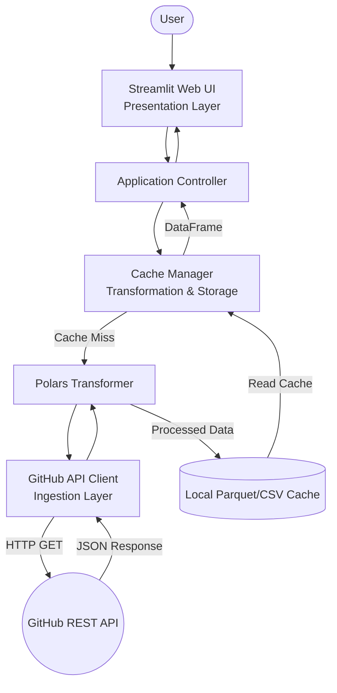

# GitHub Repository Analysis Dashboard PoC


A high-performance, strictly typed Proof of Concept (PoC) for analyzing GitHub repositories. This system ingests live data from the GitHub REST API, processes commit histories at lightning speed using Polars, and presents interactive visualizations via Streamlit, all while enforcing strict architectural boundaries and security best practices.

## Key Features

*   **Live API Integration**: Connects directly to the GitHub REST API to fetch real-time repository metadata and commit histories.
*   **High-Performance Aggregation**: Leverages `polars` to transform and aggregate thousands of commit records efficiently, calculating daily trends and identifying top contributors.
*   **Intelligent Local Caching**: Implements a Time-to-Live (TTL) Parquet-based caching mechanism to drastically reduce API latency and completely prevent rate-limiting penalties.
*   **Zero-Exposure Security**: Strictly enforces environment-variable-only credential management (`dotenv`), ensuring GitHub Personal Access Tokens are never hardcoded, leaked in logs, or exposed in the UI.
*   **Robust Error Handling**: Domain-specific exceptions intercept API failures (e.g., 404 Not Found, 403 Rate Limit), translating them into user-friendly UI alerts without crashing the application.

## Architecture Overview

The system is built on a tiered architecture ensuring separation of concerns:
1.  **Ingestion Layer**: Safely interacts with the GitHub API, parses JSON, and validates data using strict Pydantic models.
2.  **Processing & Storage Layer**: Aggregates data using Polars and manages the local disk cache.
3.  **Presentation Layer**: A lightweight Streamlit UI that orchestrates the backend and renders charts.



## Prerequisites

*   Python >= 3.12
*   [`uv`](https://docs.astral.sh/uv/) (Extremely fast Python package installer and resolver)
*   A GitHub Personal Access Token (for Live API access)

## Verified Capabilities (Current Phase)

*   **Secure Environment**: Loads configuration strictly from environment variables without exposing sensitive tokens.
*   **API Ingestion**: Connects to the GitHub REST API (`get_repository_metadata`, `get_recent_commits`).
*   **Strict Typing**: Ensures all received JSON payloads conform strictly to domain models (`RepositoryMetadata`, `CommitRecord`) mapped with Pydantic.
*   **Resilience & Graceful Failures**: Maps HTTP exceptions accurately to domain errors (e.g. `RepositoryNotFoundError`, `RateLimitError`).
*   **Interactive UAT**: Verified by an interactive Marimo Notebook (`UAT_AND_TUTORIAL.py`).

## Installation & Setup

1.  **Clone the repository:**
    ```bash
    git clone <repository_url>
    cd <repository_directory>
    ```

2.  **Install dependencies using `uv`:**
    ```bash
    uv sync
    ```

3.  **Configure Environment Variables:**
    Copy the example environment file and add your GitHub token.
    ```bash
    cp .env.example .env
    # Edit .env and insert your actual token at GITHUB_TOKEN=
    ```

## Usage

### Launch the Streamlit Dashboard

Run the main application using the `uv` environment:

```bash
uv run streamlit run src/presentation/app.py
```

*   Open your browser to the URL provided in the terminal (usually `http://localhost:8501`).
*   Enter a repository name in the format `owner/repo` (e.g., `streamlit/streamlit` or `tiangolo/fastapi`).
*   View the generated KPIs, commit trends, and top committer charts.

### Run the Interactive Tutorial

To understand the system's inner workings and validate the data flow step-by-step:

```bash
uv run marimo edit tutorials/UAT_AND_TUTORIAL.py
```

## Development Workflow

This project adheres to strict quality standards. Ensure you run the following commands before submitting code:

*   **Run Linters & Formatting (Ruff)**:
    ```bash
    uv run ruff check .
    uv run ruff format .
    ```

*   **Run Type Checking (Mypy)**:
    ```bash
    uv run mypy src tests
    ```

*   **Run Tests (Pytest)**:
    ```bash
    # Run isolated unit tests (Mocked API)
    uv run pytest tests/unit

    # Run full test suite with coverage
    uv run pytest
    ```

## Project Structure

```text
.
├── .env.example
├── pyproject.toml
├── src/
│   ├── config.py
│   ├── domain/        # Pydantic Models & Exceptions
│   ├── ingestion/     # GitHub API Client
│   ├── processing/    # Polars Transformer & Cache
│   └── presentation/  # Streamlit UI & Controller
├── tests/
│   ├── unit/
│   └── integration/
└── tutorials/         # Marimo UAT notebooks
```

## License

This project is licensed under the MIT License.
