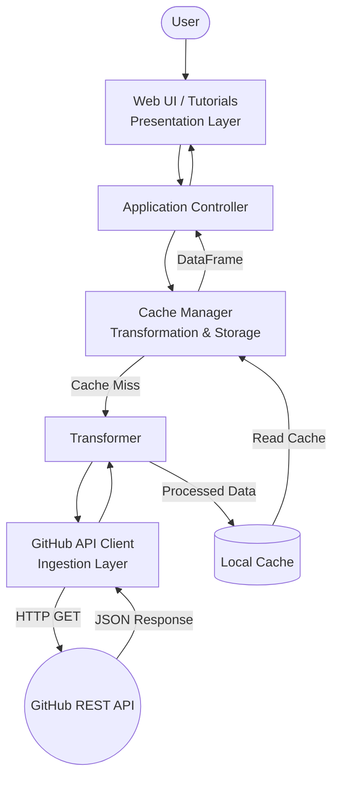

# GitHub Repository Analysis Dashboard PoC


A high-performance, strictly typed Proof of Concept (PoC) for analyzing GitHub repositories. This system ingests live data from the GitHub REST API, processes commit histories, and prepares it for interactive visualization, all while enforcing strict architectural boundaries and security best practices.

## Key Features

*   **Live API Integration**: Connects directly to the GitHub REST API to fetch real-time repository metadata and commit histories.
*   **Zero-Exposure Security**: Strictly enforces environment-variable-only credential management (`dotenv`), ensuring GitHub Personal Access Tokens are never hardcoded, leaked in logs, or exposed in the UI.
*   **Robust Error Handling**: Domain-specific exceptions intercept API failures (e.g., 404 Not Found, 403 Rate Limit), translating them into user-friendly UI alerts without crashing the application.
*   **Strictly Typed Schema**: Leverages `pydantic` to enforce mathematical contracts for data ingested from the external API.

## Architecture Overview

The system is built on a tiered architecture ensuring separation of concerns:
1.  **Ingestion Layer**: Safely interacts with the GitHub API, parses JSON, and validates data using strict Pydantic models.
2.  **Processing & Storage Layer**: Designed to aggregate data and manage the local disk cache.
3.  **Presentation Layer**: Designed for a lightweight UI that orchestrates the backend.



## Prerequisites

*   Python >= 3.12
*   [`uv`](https://docs.astral.sh/uv/) (Extremely fast Python package installer and resolver)
*   A GitHub Personal Access Token (for Live API access)

## Installation & Setup

1.  **Clone the repository:**
    ```bash
    git clone <repository_url>
    cd <repository_directory>
    ```

2.  **Install dependencies using `uv`:**
    ```bash
    uv sync
    ```

3.  **Configure Environment Variables:**
    Copy the example environment file and add your GitHub token.
    ```bash
    cp .env.example .env
    # Edit .env and insert your actual token at GITHUB_TOKEN=
    ```

## Usage

### Run the Interactive Tutorial

To understand the system's inner workings and validate the data flow step-by-step:

```bash
uv run marimo edit tutorials/UAT_AND_TUTORIAL.py
```

## Development Workflow

This project adheres to strict quality standards. Ensure you run the following commands before submitting code:

*   **Run Linters & Formatting (Ruff)**:
    ```bash
    uv run ruff check .
    uv run ruff format .
    ```

*   **Run Type Checking (Mypy)**:
    ```bash
    uv run mypy src tests
    ```

*   **Run Tests (Pytest)**:
    ```bash
    # Run isolated unit tests (Mocked API)
    uv run pytest tests/unit

    # Run full test suite with coverage
    uv run pytest --cov=src
    ```

## Project Structure

```text
.
├── .env.example
├── pyproject.toml
├── src/
│   ├── config.py
│   ├── domain_models/ # Pydantic Models & Exceptions
│   └── ingestion/     # GitHub API Client
├── tests/
│   └── unit/
└── tutorials/         # Marimo UAT notebooks
```

## License

This project is licensed under the MIT License.
