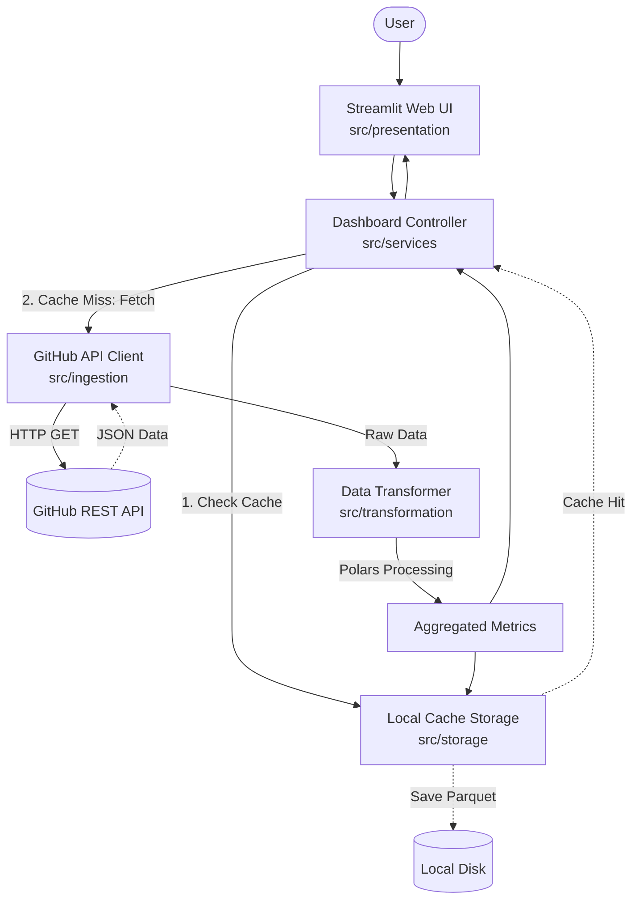

# GitHub Analytics Dashboard PoC


A robust, strictly-typed Proof of Concept (PoC) for analyzing GitHub repositories. This dashboard seamlessly fetches real-time data from the GitHub REST API, processes the metrics using high-performance Polars DataFrames, and renders interactive visual insights via Streamlit, all while enforcing strict rate-limit caching and security best practices.

## Key Features

- **Live GitHub API Integration**: Securely connects to GitHub to fetch repository metrics (Stars, Forks, Issues) and recent commit histories without hardcoding credentials.
- **High-Performance Data Processing**: Leverages Polars to aggregate commit timelines and identify top committers with blazing speed.
- **Intelligent Local Caching**: Implements a Time-To-Live (TTL) Parquet-based caching mechanism to prevent exhausting API rate limits and ensure instantaneous UI updates on repeated queries.
- **Strict Error Handling**: Gracefully intercepts network issues, 403 Forbidden limits, and 404 Not Found errors, ensuring no stack traces or sensitive data leak to the user interface.
- **Zero-Config Web Dashboard**: A pure Streamlit presentation layer offering a clean, interactive user experience with line and bar charts.

## Architecture Overview

The system operates using a multi-tiered architecture with strict separation of concerns, heavily relying on Pydantic domain models for data validation at the boundaries.



## Prerequisites

- **Python**: 3.12 or higher.
- **Package Manager**: [uv](https://github.com/astral-sh/uv) (strictly enforced for dependency management).
- **Credentials**: A valid GitHub Personal Access Token (PAT).

## Installation & Setup

1. **Clone the repository**:
   ```bash
   git clone <repository_url>
   cd <repository_directory>
   ```

2. **Sync Dependencies**:
   Utilize `uv` to install the environment and requirements.
   ```bash
   uv sync
   ```

3. **Configure Environment Variables**:
   Copy the example environment file and insert your GitHub token.
   ```bash
   cp .env.example .env
   # Edit .env and add your GITHUB_TOKEN
   ```

## Usage

**Quick Start**:
To launch the interactive dashboard, run the Streamlit application using `uv`:

```bash
uv run streamlit run src/presentation/app.py
```

Once the server starts, open the provided local URL in your browser. Enter a repository name in the `owner/repo` format (e.g., `streamlit/streamlit` or `tiangolo/fastapi`) and click "Analyze" to view the metrics and charts.

## Development Workflow

This project adheres to strict typing and linting standards. Use the following commands during development:

- **Run Tests**: Execute the test suite with coverage reporting.
  ```bash
  uv run pytest
  ```
- **Run Linters**: Format and check the code using Ruff.
  ```bash
  uv run ruff format .
  uv run ruff check .
  ```
- **Type Checking**: Enforce strict Mypy checks.
  ```bash
  uv run mypy .
  ```

## Project Structure

```text
.
├── src/
│   ├── domain_models/   # Core entities (Repository, Commit schemas), Pydantic Settings and env loading
│   ├── github_client.py # GitHub API HTTP Client
├── tests/               # Pytest suites (Unit, E2E, UAT Marimo notebooks)
├── .env.example         # Template for environment secrets
└── pyproject.toml       # uv dependency and tool configuration
```

## License

MIT License.
