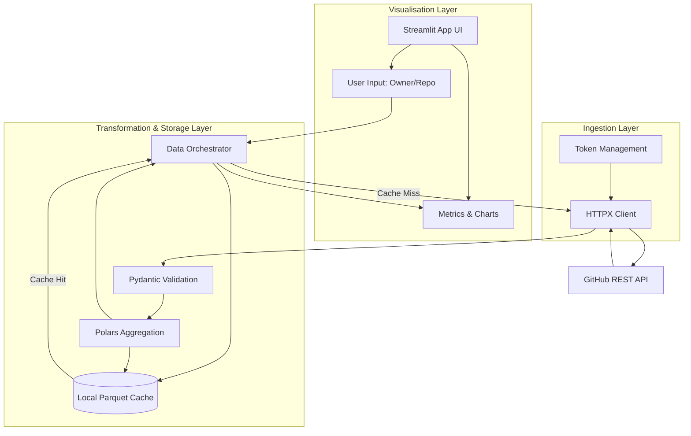

# GitHub Repository Analytics Dashboard


A modern, high-performance Proof-of-Concept (PoC) dashboard for analysing GitHub repository data. This application securely connects to the GitHub REST API to fetch, process, cache, and visualise repository metrics and commit histories, offering an intuitive interface built entirely in Python.

## Key Features

- **Automated Data Ingestion:** Seamlessly connects to the GitHub REST API with robust error handling and strict rate limit protection.
- **High-Performance Aggregation:** Leverages `Polars` for zero-copy, lightning-fast tabular data transformations.
- **Zero-Config Local Caching:** Implements an intelligent, Time-To-Live (TTL) based local Parquet file cache to drastically reduce API latency and respect network constraints.
- **Interactive Visualisations:** Provides a clean, responsive web interface using `Streamlit` to display core repository KPIs and interactive charts of developer activity over time.
- **Type-Safe Architecture:** Built with strict `Pydantic` domain models and rigorous MyPy static typing, ensuring data integrity from network response to frontend rendering.

## Architecture Overview

The system is designed with a strict layered architecture, separating concerns across Data Ingestion, Transformation/Storage, and Visualisation. This prevents tight coupling and allows individual components to be tested and evolved independently.



## Prerequisites

- **Python:** 3.12 or newer.
- **Package Manager:** `uv` is required for dependency and environment management.
- **GitHub Token:** A Personal Access Token (PAT) is required to access the GitHub API.

## Installation & Setup

1. **Clone the repository:**
   ```bash
   git clone <repository_url>
   cd <repository_directory>
   ```

2. **Install dependencies using `uv`:**
   ```bash
   uv sync
   ```

3. **Configure Environment Variables:**
   Copy the example environment file and populate it with your GitHub Personal Access Token.
   ```bash
   cp .env.example .env
   # Edit .env and set GITHUB_TOKEN=your_token_here
   ```

## Usage

**Quick Start:**

To verify configuration loading via the interactive Python shell:

```python
from src.config import get_settings
settings = get_settings()
print(settings.GITHUB_TOKEN)
```

## Development Workflow

This project adheres to strict code quality standards.

- **Run Linters (Ruff):**
  ```bash
  uv run ruff check .
  ```
- **Run Type Checker (MyPy):**
  ```bash
  uv run mypy .
  ```
- **Run Tests (Pytest):**
  ```bash
  uv run pytest
  ```
- **Run User Acceptance Tests (Marimo):**
  ```bash
  uv run marimo run tests/uat/UAT_AND_TUTORIAL.py
  ```

## Project Structure

```text
.
├── .env.example         # Template for environment variables
├── pyproject.toml       # Dependency and linter configuration
├── README.md            # Project documentation
├── src/
│   ├── config.py        # Pydantic-based configuration management
│   └── domain_models/   # Pydantic schemas and custom exceptions
└── tests/
    ├── uat/             # Marimo notebooks for UAT and tutorials
    └── ...              # Unit and integration tests
```

## License

MIT License
