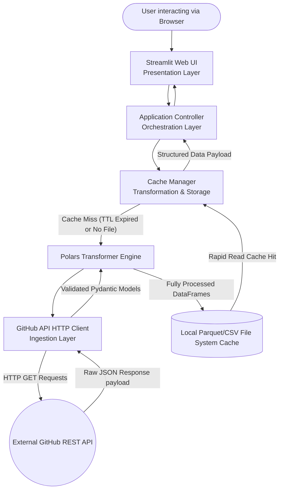

# System Architecture Document

## Summary
This document outlines the comprehensive system architecture for the GitHub Repository Analysis Dashboard Proof of Concept (PoC). The system is strategically engineered using Python, integrating Polars for highly efficient, multi-threaded data transformation, and Streamlit for dynamic, user-friendly interactive web visualisations. Its primary objective is to provide developers and analysts with deep, immediate insights into any specified GitHub repository by fetching live data directly from the official GitHub REST API. This raw data is then processed locally with exceptional performance to extract key performance indicators (KPIs)—such as total stars, forks, and open issues—alongside historical trends like daily commit frequency and top contributor leaderboards. By rigorously adhering to modern software engineering principles, including strict separation of concerns, defensive programming, and robust error boundary management, the system ensures high reliability, scalability, and ease of maintenance throughout its entire lifecycle.

## System Design Objectives
The primary design objective of this project is to architect a robust, fully functional Proof of Concept (PoC) for a GitHub Repository Analysis Dashboard that demonstrates the seamless, end-to-end integration of live external API ingestion, heavy data processing, and an interactive visualisation layer. This system must be constructed with a profound emphasis on security, particularly concerning the handling of authentication credentials, and must enforce strict architectural boundaries across all its distinct modules to prevent tight coupling. The design must inherently accommodate future scalability, allowing for the potential addition of new, complex metrics (such as pull request velocity or issue resolution times), alternative external data sources (like GitLab or Bitbucket), or more sophisticated analytical models without ever necessitating a complete rewrite of the existing codebase.

A paramount and non-negotiable constraint of the system is the absolute necessity to protect GitHub Personal Access Tokens. The GitHub REST API severely rate-limits unauthenticated requests, making a token essential for a functional application. Under no circumstances whatsoever should these sensitive tokens be hardcoded into the Python source code, checked into version control, or inadvertently exposed in application logs, unhandled exception stack traces, or the graphical user interface. The system must strictly utilise environment variables, loaded via the `python-dotenv` library from a local `.env` file, to manage these secrets securely. An `.env.example` file must be continuously maintained as a safe, secret-free template for developers. This security-first, zero-trust approach forms the bedrock of our system's integrity.

Another critical constraint is the intelligent and respectful handling of GitHub API rate limits and network latency. The system must implement robust, local caching mechanisms to minimise redundant outbound HTTP network requests. This is vital to prevent the application from being temporarily blocked by GitHub due to excessive traffic (HTTP 429 Too Many Requests errors). The local storage of fully processed data in columnar formats like Apache Parquet serves as this high-performance caching layer. This guarantees that repeated queries for the exact same repository within a specified Time-to-Live (TTL) window are served almost instantaneously from the local solid-state drive rather than triggering a slow, expensive network sequence. This strategic decision not only protects the application from rate-limiting penalties but also drastically elevates the end-user experience by reducing dashboard load times from seconds to mere milliseconds for cached requests.

The success criteria for this PoC are defined by its ability to reliably execute end-to-end operations flawlessly under normal conditions, and, equally importantly, to fail gracefully and safely under abnormal conditions. Specifically, the system must successfully establish a secure TLS connection to the GitHub API, accurately parse the incoming JSON responses, validate them against strict schema definitions, transform the raw data into structured Polars DataFrames using vectorized operations, aggregate the necessary metrics (such as daily commit counts over a timeline and ranking the top five committers by volume), and render these metrics accurately on a reactive Streamlit dashboard. Furthermore, the system must demonstrate exceptional resilience by gracefully intercepting and handling network timeouts, invalid user inputs (e.g., malformed repository strings), and unauthorised access attempts. When such an error occurs, the system's controller layer must catch the internal exception and translate it into a safe, user-friendly, and informative error message displayed on the UI, ensuring no sensitive internal state is ever leaked to the user.

In addition to functional requirements, the system must adhere to uncompromising code quality and maintainability standards. The architecture must leverage modern software design patterns, specifically Dependency Injection and the Repository Pattern, to cleanly decouple the data fetching logic from the data processing and the final presentation logic. This modularity ensures that individual components—such as the GitHub client or the Polars transformer—can be tested in absolute isolation, modified, or even entirely replaced with minimal impact on the broader system. The codebase must be fully and strictly type-hinted, passing all static analysis checks enforced by stringent configurations of tools like `mypy` and the `ruff` linter. This commitment to code quality ensures that the system remains intelligible and maintainable as it inevitably evolves beyond the initial PoC phase into a more feature-rich, mature product. The core additive mindset is essential: any new features must be implemented by extending existing interfaces rather than modifying core, proven logic, thereby preserving the stability of the foundation.

## System Architecture
The overall system architecture of the GitHub Repository Analysis Dashboard is built upon a highly modular, multi-tiered design pattern that strictly enforces the separation of concerns. This layered approach deliberately prevents the formation of convoluted, tightly coupled "God Classes" and guarantees that each individual component possesses a single, unambiguous responsibility. The architecture is logically segmented into three primary, sequential layers: the Ingestion Layer (API Client), the Transformation and Storage Layer (Data Processing and Local Caching), and the Presentation Layer (Web UI). This tiered, unidirectional data flow structure allows for independent scaling, isolated unit testing, and agile evolution of each specific part of the system.

At the very foundation of the architecture lies the Ingestion Layer. This layer is exclusively responsible for managing all outgoing interactions with external systems, specifically communicating with the GitHub REST API over HTTPS. This critical layer encapsulates the HTTP client logic (utilizing robust libraries like `httpx` or `requests`), manages the injection of authentication headers, handles HTTP persistent connections, and performs the initial parsing of raw JSON responses. By completely isolating these responsibilities, the remainder of the application remains entirely agnostic to the volatile specifics of the GitHub API, such as its exact URL routing structure, its specific pagination mechanisms (like parsing Link headers), or its unique rate-limit headers. The Ingestion Layer must carefully and defensively handle network anomalies, DNS resolution failures, connection timeouts, and API-specific HTTP errors (notably 404 Not Found, 403 Forbidden, or 429 Too Many Requests). It must translate these raw HTTP errors into meaningful, domain-specific Python exceptions that can be comprehensively understood and handled by the upper layers of the application. This explicit boundary management ensures that catastrophic external network failures do not cascade uncontrollably, crashing the entire application.

Moving sequentially up the technology stack, the Transformation and Storage Layer serves as the high-octane core engine for data manipulation, aggregation, and performance optimisation. This layer receives raw, validated Pydantic models from the Ingestion Layer and leverages the immense power of the Polars library to convert these models into highly structured, strictly typed DataFrames. Polars was strategically selected for this pivotal role due to its exceptional performance characteristics, particularly its multi-threaded execution engine and its highly efficient memory layout based on Apache Arrow, which are absolutely crucial for processing potentially massive commit histories quickly without exhausting system RAM. This layer is responsible for executing all necessary business logic required to aggregate the raw data, such as executing fast `group_by` operations to bucket commits by calendar date or by individual author name. Furthermore, this layer implements the sophisticated local caching strategy. It serialises the fully processed Polars DataFrames into highly compressed Parquet files written directly to local disk storage. By positioning the caching mechanism at this specific point in the data pipeline, the system mathematically guarantees that the Presentation Layer is shielded from both the severe latency of external network requests and the computational overhead of heavy data processing whenever a valid, unexpired cached file is available.

The uppermost tier of the architecture is the Presentation Layer, rapidly developed and deployed using the Streamlit framework. This specific layer is strictly and exclusively responsible for rendering the graphical user interface, capturing user inputs (like typing the specific target repository name), and displaying the final aggregated metrics and dynamic charts. It must contain absolutely zero core business logic or data fetching mechanisms. Instead, it interacts with the underlying Transformation and Storage Layer exclusively through well-defined, strictly typed interface boundaries orchestrated by a central Controller module. This strict, uncompromising separation guarantees that the UI remains lightweight, responsive, and completely declarative. If the strategic requirement arises in the future to replace Streamlit with a different frontend framework (for example, migrating to a FastAPI backend serving a complex React or Vue.js frontend application), the underlying Ingestion and Transformation layers can be reused in their entirety without requiring a single line of modification. This additive, highly flexible, and future-proof mindset is a defining cornerstone of our overarching architectural strategy.



The system strictly and consistently adheres to rigid boundary management rules. The Streamlit UI layer must never directly import or invoke the GitHub API client module. All data flows must proceed sequentially and predictably through the carefully defined architectural layers. Robust Pydantic models are extensively utilised as Data Transfer Objects (DTOs) passing between these layers, fundamentally ensuring that data is strictly typed and mathematically validated at every single boundary crossing. This explicit, enforced contract between layers drastically facilitates easier, more reliable mocking during automated testing phases and significantly reduces the statistical likelihood of cryptic runtime errors caused by unexpected or malformed data formats.

## Design Architecture
The design architecture of the system explicitly dictates the logical, structural organisation of the Python codebase and defines the fundamental data models that flow seamlessly through it. The physical file structure is meticulously and thoughtfully planned to flawlessly reflect the modular, tiered architecture described in the previous section, ensuring that software engineers can intuitively locate the exact components they need to modify, debug, or extend without navigating a labyrinthine directory tree. The project is cleanly organised into distinct directories representing the core domain logic, external network integrations, heavy data processing engines, and the final user interface application.

```text
.
├── .env.example
├── pyproject.toml
├── README.md
├── src/
│   ├── __init__.py
│   ├── config.py
│   ├── domain/
│   │   ├── __init__.py
│   │   ├── models.py
│   │   └── exceptions.py
│   ├── ingestion/
│   │   ├── __init__.py
│   │   └── github_client.py
│   ├── processing/
│   │   ├── __init__.py
│   │   ├── transformer.py
│   │   └── cache_manager.py
│   └── presentation/
│       ├── __init__.py
│       ├── controller.py
│       └── app.py
└── tests/
    ├── __init__.py
    ├── conftest.py
    ├── unit/
    ├── integration/
    └── e2e/
```

At the absolute mathematical heart of the design are the Core Domain Pydantic Models. These strictly typed models serve as the singular, indisputable source of truth for the entire system's data structures, providing rigorous, fail-fast runtime type checking and comprehensive validation logic. By defining these models centrally within the `src/domain/models.py` file, we mathematically guarantee structural consistency across all disparate layers of the complex application. The `RepositoryMetadata` model accurately encapsulates all essential, high-level information, demanding strict types for the repository name (string), owner (string), star count (integer), fork count (integer), and open issue count (integer). The crucial `CommitRecord` model precisely represents individual atomic commits within the repository's history, mandating strict validation for the commit hash string, author name string, and enforcing that the date string is successfully parsable into a native Python `datetime` or `date` object. These domain models are explicitly designed to be additive and evolutionary; if future business requirements demand the extraction of additional data points (for example, analyzing pull request statistics or issue resolution velocity), new optional fields can be safely and easily appended to these existing Pydantic schemas without breaking or destabilizing any existing downstream consumers of the data.

The critical integration boundaries between these core domain objects and the rest of the functional system are clearly, unambiguously defined. The `github_client.py` module, residing within the Ingestion layer, bears the crucial responsibility for parsing raw, untyped JSON dictionaries directly into these strictly typed Pydantic models instantaneously upon receiving a successful HTTP response. This critical early-stage validation ensures that any invalid, malformed, or incomplete data emitted by the external API is immediately caught right at the system boundary, categorically preventing corrupt data from propagating deeper into the delicate internal processing pipelines. The `transformer.py` module within the Processing layer subsequently acts as the primary consumer of massive lists containing these validated Pydantic models. It is responsible for rapidly converting them into incredibly efficient Polars DataFrames to facilitate highly optimized bulk mathematical operations. This deliberate transition from strongly-typed, object-oriented Python models to high-performance, columnar DataFrames represents a highly calculated design choice intended to perfectly balance the absolute need for type safety at the boundary with the necessity for extreme computational efficiency during the aggregation phase.

Furthermore, the design purposefully incorporates specific, advanced mechanisms for future extensibility. The strategic use of the Pydantic library allows for the creation of foundational base models that can be easily inherited and cleanly extended by new, more complex schema objects as the specific domain complexity of the application inevitably grows over time. For instance, a generic `MetricResult` base model could be intelligently extended into highly specific `CommitTrendMetric` or `TopCommitterMetric` classes to provide beautifully structured, strictly validated outputs specifically tailored for the UI layer. This unwavering adherence to modern, proven software design patterns—specifically the rigorous use of strictly typed contracts and uncompromising data validation at every single architectural boundary—fundamentally prevents the emergence of tightly coupled, fragile spaghetti code and guarantees that the system remains exceptionally robust, reliable, and gracefully adaptable to any future feature enhancements.

## Implementation Plan

### CYCLE01: API Client and Data Extraction (Ingestion)
The initial development cycle focuses entirely and exclusively on establishing a highly robust, incredibly secure, and perfectly reliable network connection to the external GitHub REST API. The primary, overriding objective is to flawlessly implement the foundational Ingestion Layer, ensuring that the system can authenticate correctly via tokens, handle severe rate limits gracefully without crashing, and successfully retrieve the required raw JSON payloads. We will begin by meticulously setting up the necessary configuration management infrastructure using the `python-dotenv` library to securely load the highly sensitive GitHub Personal Access Token exclusively from the local `.env` file. This strictly enforces the absolute rule that no secure credentials are ever hardcoded or committed to the repository. This initial step inherently includes creating the crucial `.env.example` template file.

Following secure configuration, the core `github_client.py` module will be developed. This module will expertly encapsulate the Python HTTP client library (such as `httpx`) to perform secure GET requests against the specific `/repos/{owner}/{repo}` REST endpoint to acquire repository metadata, and against the `/repos/{owner}/{repo}/commits` endpoint to fetch the chronological commit history. Crucially, this client must implement highly sophisticated, defensive error handling logic. It must accurately distinguish between a 404 Not Found (indicating an invalid repository name was entered), a 401/403 Unauthorized (indicating a missing or expired access token), and a 429 Too Many Requests (indicating the rate limit has been exceeded). For each distinct scenario, the client must intercept the raw HTTP error and raise a specific, highly descriptive custom domain exception. The raw JSON responses will be immediately parsed and rigorously validated against our core Pydantic models to mathematically ensure data integrity right at the system boundary. By the absolute conclusion of this first cycle, the overall system will possess a fully functional, highly secure Python subsystem capable of extracting strongly typed data from the live external API.

### CYCLE02: Data Transformation and Local Caching (Transformation & Storage)
The second development cycle rapidly builds upon the rock-solid foundation established in Cycle 1 by intricately introducing the highly performant Transformation and Storage Layer. The raw, strictly validated Pydantic models successfully acquired from the Ingestion Layer must now be processed and aggregated into meaningful, actionable analytical formats. We will seamlessly integrate the Rust-backed `polars` library to perform high-speed, multi-threaded data manipulation. The highly focused `transformer.py` module will be meticulously implemented to execute two highly specific data aggregations: mathematically calculating the absolute number of commits per calendar day (formatted strictly as YYYY-MM-DD) and definitively determining the top 5 distinct committers by sheer commit volume. Polars' highly expressive, vectorized API will be extensively utilised to ensure these data transformations are both highly readable for developers and exceptionally performant during runtime.

Simultaneously, we will architect and implement the mission-critical caching mechanism within the `cache_manager.py` module. This is vital to aggressively protect against punitive API rate limits and substantially improve overall application responsiveness. This manager will bear the sole responsibility for accurately serialising the fully aggregated Polars DataFrames into the highly compressed Parquet file format and securely saving them directly to a local temporary directory on the host machine. A strict Time-to-Live (TTL) expiry logic, initially configured to exactly 1 hour (3600 seconds), will be robustly implemented. Before the application controller attempts to fetch any new data from the API via the Ingestion Layer, the Cache Manager must first securely check the local disk to determine if a valid, unexpired Parquet file exists for the specifically requested repository. If it does exist, the data will be read instantaneously from the disk cache, bypassing the external API network entirely. This cycle mandates the careful, secure implementation of file system I/O operations and robust defensive programming to handle any potential cache corruption or file permission issues gracefully.

### CYCLE03: Web UI Construction (Visualization)
The third and ultimate cycle focuses squarely on delivering the polished, user-facing component of the PoC by constructing the reactive Presentation Layer using the Streamlit framework. The central `app.py` module will be meticulously created to serve as the main, accessible entry point for the web application. The graphical user interface will be thoughtfully designed for maximum simplicity and intuitive ease of use, featuring a highly prominent text input field where users can easily specify their target repository strictly in the `owner/repo` string format. Robust input validation logic will be implemented immediately at this UI level to intelligently catch obvious string formatting errors before any backend network or processing logic is wastefully triggered.

Once a mathematically valid repository string is submitted by the user, the Streamlit UI will seamlessly orchestrate the internal data flow by invoking the central Application Controller. This controller, in turn, interacts securely with the Cache Manager and the underlying API Client as carefully implemented in the previous cycles. The successfully retrieved and processed data payloads will then be beautifully visualised. The core repository metadata (total stars, forks, open issues) will be highly prominently displayed as large, readable KPI metric blocks at the very top of the interactive dashboard. Directly below these KPIs, Streamlit's native, interactive charting functions (specifically `st.line_chart` and `st.bar_chart`) will be strategically utilised to accurately render the chronological commit history trends over time and the competitive leaderboard of the top contributors. A mathematically critical aspect of this final cycle is implementing absolutely graceful, unbreakable error handling within the UI; any underlying exceptions raised by the lower architectural layers (for instance, catastrophic API connection failures or subtle data parsing errors) must be securely caught by the controller and safely displayed to the user as friendly, non-threatening warning or error messages (`st.error`), strictly and absolutely avoiding the dangerous exposure of raw Python stack traces or secure tokens to the end-user.

## Test Strategy

### CYCLE01
The comprehensive testing strategy for Cycle 1 mandates a highly rigorous, paranoid approach to thoroughly validating the critical Ingestion Layer. Atomic unit tests must be meticulously written to verify the configuration loading mechanism, definitively ensuring that the system correctly, securely reads the secret token from the local `.env` file and, crucially, fails appropriately and safely if the critical token is entirely missing or completely malformed. The absolute core of the focused testing effort will center on the complex `github_client.py` module. We will expertly utilise the robust `unittest.mock` or `pytest-mock` frameworks extensively to artificially simulate a vast array of potential API responses without ever initiating actual outbound network calls. This complex simulation involves securely mocking the underlying HTTP client library to instantly return perfectly formatted, successful JSON payloads, deliberately simulating 404 Not Found HTTP errors for theoretically non-existent repositories, and aggressively simulating 403/429 authorization and rate-limiting errors to explicitly verify that the client logic accurately intercepts these network failures and correctly raises the specific, highly descriptive custom Python domain exceptions.

Crucially and unconditionally, the DB Rollback Rule and total sandbox resilience must be respected at all times. Any tests that fundamentally require setting up temporary system state or touching the file system must strictly use Pytest fixtures that automatically and definitively clean up after themselves, ensuring lightning-fast, pristine state resets for every single test execution. Furthermore, precisely because the isolated sandbox environment executing these tests autonomously will physically not possess real, valid GitHub API keys, it is absolutely, categorically critical that all external API network calls are comprehensively mocked in all standard unit and integration tests. Attempting to execute real network calls without injecting valid credentials will definitively cause the automated CI pipelines to fail catastrophically. However, to explicitly fulfill the user's specific requirement for Live API E2E testing, a completely separate, explicitly marked test suite (utilizing decorators like `@pytest.mark.live`) will be meticulously created. This dangerous live suite will only be permitted to run when a valid token is explicitly provided by the environment, and it will perform actual, real-world HTTP requests against a known, highly stable, massive repository (such as `streamlit/streamlit`) to definitively verify the end-to-end network connectivity and the complex JSON parsing logic against real-world, live data payloads.

### CYCLE02
Testing in the second cycle focuses exclusively and intensely on verifying the mathematical accuracy of the complex data transformations and the absolute reliability of the file-based caching mechanism. Comprehensive unit tests for the highly complex `transformer.py` module will be absolutely critical to system integrity. We must securely provide static, perfectly well-defined mock datasets (for instance, a hardcoded Python list of beautifully mocked Pydantic `CommitRecord` objects) as direct input to the transformation functions and rigorously mathematically assert that the resulting Polars DataFrames contain exactly, precisely the expected aggregated numerical values for daily commit counts and the top 5 committers. These tests must obsessively account for extremely obscure edge cases, such as handling completely empty datasets without crashing, processing datasets with commits spanning across multiple leap years, and definitively resolving datasets where multiple developers possess the exact same number of commits (exhaustively testing the Polars tie-breaking and sorting algorithms).

The critical `cache_manager.py` module must be tested using an advanced strategy that completely isolates volatile file system operations. Pytest's built-in, highly secure `tmp_path` fixture is absolutely mandatory for these specific tests. The automated tests will definitively verify that the storage manager can successfully, completely write a massive DataFrame to a highly compressed Parquet file within the isolated temporary directory, that it can subsequently read that exact file back into an identical, mathematically identical DataFrame in memory, and that it correctly, reliably identifies when a cached file has definitively expired based on the strict mathematical TTL logic. We must also aggressively simulate severe file system failures, such as hard disk permission denied errors or catastrophic disk full scenarios, using advanced mocking techniques to ensure the broader system handles these hardware-level faults gracefully without crashing the main application thread. The underlying DB Rollback Rule applies here metaphorically: every single test interacting with the host file system must mathematically start with a completely pristine, empty temporary directory and leave absolutely no residual or orphaned files behind upon completion, ensuring absolute, uncompromising test isolation.

### CYCLE03
The final test strategy for Cycle 3 intricately involves verifying the reactive Presentation Layer and the overall, complex integration of the entire application stack. Since testing Streamlit UIs directly via automated browser tools (like Selenium) can be notoriously complex, flaky, and brittle, our primary, laser-focused engineering effort will be entirely on testing the intermediate application controller logic that acts as the vital bridge feeding data to the UI. We will meticulously write comprehensive integration tests that perfectly simulate a user's browser request by directly calling the main entry point controller function with a mocked repository name string. These robust tests will aggressively mock the external API network call (if the system is not actively relying on a cached data file) but will explicitly permit the data payload to flow entirely through the Transformation and Storage layers, finally mathematically asserting that the deeply structured data objects returned to the UI layer exactly match the expected schema structures.

Furthermore, we will employ an incredibly rigorous, structured manual or script-assisted User Acceptance Testing (UAT) process. The provided, highly detailed `USER_TEST_SCENARIO.md` document will serve as the absolute, non-negotiable script for this crucial validation phase. We will visually and programmatically verify that the UI renders the perfectly correct KPIs and accurate charts when provided with perfectly valid input strings, and that it reliably displays highly appropriate, human-readable, safe error messages when provided with malformed input or when simulated, catastrophic backend API errors suddenly occur. The strict, overriding security requirement that absolutely no secrets or secure tokens are ever exposed in the UI or printed to terminal logs will be verified dynamically and aggressively by executing the running application with completely invalid tokens and meticulously inspecting the terminal output streams. Final End-to-End (E2E) verification will be successfully confirmed by mathematically ensuring that the simple `streamlit run` terminal command successfully launches the complex web application and perfectly processes a complete, unbroken data flow originating from the live external GitHub API all the way to the interactive, reactive user dashboard.
