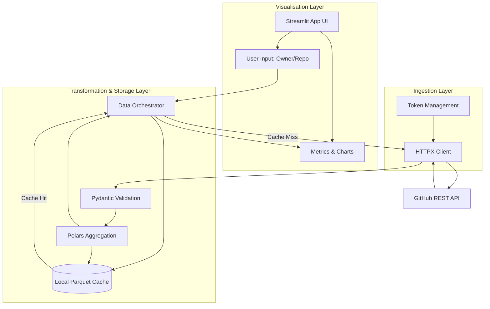

# System Architecture

## Summary
The system is a Proof-of-Concept (PoC) dashboard for analysing GitHub repository data. It fetches, processes, caches, and visualises basic repository metrics and commit histories using a fully typed Python stack comprising Polars and Streamlit. The system connects to the GitHub REST API securely, respecting rate limits and isolating secrets from the source code. It follows modern software engineering principles, employing Pydantic for data validation, Polars for efficient tabular transformations, and Streamlit for an interactive user interface. Existing code structures will be cleanly augmented using the Dependency Injection and Repository patterns to prevent tight coupling, allowing new dashboard capabilities to integrate gracefully with any pre-existing architecture.

## System Design Objectives
The primary objective of this architecture is to provide a highly resilient, maintainable, and verifiable Proof of Concept (PoC) for a GitHub Repository Analytics Dashboard. This project must balance rapid prototyping capabilities with production-grade engineering principles. To achieve this, the system is designed to adhere strictly to the separation of concerns, decoupling data ingestion, data transformation, and data visualisation into distinct layers.

The first core objective is secure and robust data ingestion. The system must interact with the live GitHub REST API, which introduces the complexities of network volatility, rate limiting, and authentication. It is an absolute requirement that personal access tokens (PATs) and any other sensitive credentials are never hardcoded. They must be managed securely via environment variables, loaded dynamically during runtime, and completely isolated from logs and error traces. The architecture must enforce defensive programming when interacting with external services, handling HTTP 403 (Rate Limit Exceeded) and 404 (Not Found) status codes gracefully, returning structured error responses rather than permitting the application to crash or leak stack traces to the end user.

The second core objective focuses on efficient data processing and cost-effective local storage. By implementing a lightweight but robust local caching mechanism using the Parquet file format, the system will minimise redundant API calls. This is not just a performance optimisation; it is a critical requirement to respect GitHub's API rate limits and ensure the dashboard remains responsive during repeated queries for the same repository. Polars has been selected as the data transformation engine because of its exceptional performance, strict schema enforcement, and zero-copy capabilities. The architecture demands that all raw JSON payloads received from GitHub are immediately validated against strict Pydantic schemas before any Polars transformations occur. This guarantees that the downstream processing logic operates on clean, predictable data structures, thereby preventing runtime type errors and silent failures.

The third core objective is to deliver an intuitive and responsive user interface using Streamlit. The frontend must remain completely agnostic to the complexities of the GitHub API and the Polars data transformations. It should interact solely with a clean, well-defined service layer or repository interface that abstracts away the underlying data retrieval and caching mechanisms. This separation ensures that the UI can be tested independently and that the underlying data processing logic can be reused or replaced without modifying the presentation layer. The success of this system will be measured by its ability to accurately display repository KPIs (stars, forks, open issues) and render clear, accurate visualisations of commit histories (commits over time, top committers) while gracefully handling edge cases, invalid inputs, and API errors, all while maintaining a 100% test coverage for critical transformation logic.

## System Architecture
The system architecture follows a distinct layered approach, separating the application into three primary boundaries: Data Ingestion (API Client), Transformation and Storage (Service Layer/Cache), and Visualisation (Streamlit Frontend). This separation is crucial to prevent the emergence of a "God Class" and ensures that each component has a single responsibility.

At the foundation is the **Data Ingestion Layer**. This layer is responsible for all external communications with the GitHub REST API. It consists of an asynchronous or synchronous HTTP client (e.g., using `httpx`) configured with appropriate timeout and retry policies. The client handles the injection of the `Authorization` header, explicitly reading the token from a securely managed environment configuration via a Pydantic `BaseSettings` class. This layer is strictly forbidden from parsing or transforming the data beyond basic JSON deserialisation. Its sole purpose is to execute the HTTP requests, handle transport-level errors (like 401, 403, and 404), and return the raw JSON structures. All external API calls in this layer must be abstracted behind an interface (e.g., `GitHubClientInterface`), allowing the entire layer to be easily mocked during unit and continuous integration testing.

Above the Ingestion Layer sits the **Transformation and Storage Layer**. This is the core engine of the application. It acts as an orchestrator, receiving requests from the frontend, checking the local cache, and only delegating to the Ingestion Layer if fresh data is required. When raw data is fetched, it is first validated against strict Pydantic domain models. These models ensure that required fields (like `commit.author.date` or `stargazers_count`) are present and correctly typed. Once validated, the data is passed to Polars for transformation. The Polars module contains isolated functions dedicated to specific aggregations, such as grouping commits by date or calculating the top five committers. After processing, the resulting DataFrames are serialized to `.parquet` files in a local `.cache` directory. The caching logic calculates the TTL (Time To Live) based on file modification times. If a cached file is less than one hour old, it is read and returned directly, completely bypassing the API.

The topmost layer is the **Visualisation Layer**, built with Streamlit. This layer is intentionally thin. It is responsible solely for rendering the user interface elements: the input text box, the KPI metrics, and the charts. It captures user input, performs rudimentary format validation (e.g., ensuring the input follows the `owner/repo` pattern), and then calls the Transformation and Storage Layer. It expects to receive fully processed Polars DataFrames or structured Pydantic models containing the KPIs. The Streamlit layer handles the mapping of these structures to `st.metric`, `st.line_chart`, and `st.bar_chart`. Furthermore, it is responsible for rendering user-friendly error messages using `st.error` or `st.warning` if the underlying layers raise custom domain exceptions (such as a `RepositoryNotFoundError` or a `RateLimitExceededError`).



## Design Architecture

The file structure is designed to strictly enforce the separation of concerns outlined in the system architecture. It leverages a modern Python project layout, isolating source code, tests, and configuration.

```text
.
├── .env.example
├── README.md
├── pyproject.toml
├── src/
│   ├── __init__.py
│   ├── config.py              # Pydantic BaseSettings for env vars
│   ├── domain/
│   │   ├── __init__.py
│   │   ├── exceptions.py      # Custom domain exceptions
│   │   └── schemas.py         # Pydantic models for GitHub API responses
│   ├── ingestion/
│   │   ├── __init__.py
│   │   └── github_client.py   # HTTPX client for GitHub API
│   ├── processing/
│   │   ├── __init__.py
│   │   ├── cache.py           # Local Parquet caching logic
│   │   └── transformations.py # Polars DataFrame operations
│   └── app.py                 # Streamlit application entry point
└── tests/
    ├── __init__.py
    ├── conftest.py            # Pytest fixtures and mock setups
    ├── uat/
    │   └── UAT_AND_TUTORIAL.py # Marimo notebook for UAT scenarios
    ├── test_ingestion.py
    ├── test_processing.py
    └── test_cache.py
```

### Class and Function Definitions Overview

**1. `src/config.py`**
- `class Settings(BaseSettings)`: Defines the required environment variables, specifically `GITHUB_TOKEN`. It enforces that the token must be present in the `.env` file or the environment. It utilizes `SettingsConfigDict` to forbid extra variables and strictly read from the `.env` file. A module-level singleton `get_settings()` is provided to instantiate and return this configuration, ensuring the configuration is loaded only once.

**2. `src/domain/schemas.py`**
- `class RepositoryMetrics(BaseModel)`: Represents the core KPIs for a repository. Fields include `stargazers_count` (int), `forks_count` (int), and `open_issues_count` (int). This model ensures the raw JSON is safely parsed.
- `class CommitAuthor(BaseModel)`: Represents the author of a commit. Fields include `name` (str) and `date` (datetime).
- `class CommitData(BaseModel)`: Represents the inner commit payload. Fields include `author` (CommitAuthor).
- `class CommitItem(BaseModel)`: Represents a single commit from the API array. Fields include `commit` (CommitData).
This strict Pydantic structure prevents missing keys or type mismatches from crashing the application further downstream.

**3. `src/ingestion/github_client.py`**
- `class GitHubClient`: The primary class for communicating with GitHub.
  - `def __init__(self, token: str)`: Initializes the client with the authentication token.
  - `def get_repository_metrics(self, owner: str, repo: str) -> dict`: Fetches the repository information (`/repos/{owner}/{repo}`). Raises custom exceptions like `RepositoryNotFoundError` on 404.
  - `def get_recent_commits(self, owner: str, repo: str, limit: int = 100) -> list[dict]`: Fetches the commit history (`/repos/{owner}/{repo}/commits?per_page=100`).

**4. `src/processing/cache.py`**
- `class LocalCache`: Handles saving and loading Polars DataFrames.
  - `def get(self, key: str) -> pl.DataFrame | None`: Checks if a valid `.parquet` file exists for the given key and is within the TTL. Uses `pathlib` for all file operations.
  - `def set(self, key: str, df: pl.DataFrame) -> None`: Saves a Polars DataFrame to the local cache directory.

**5. `src/processing/transformations.py`**
- `def aggregate_commits_by_date(raw_commits: list[dict]) -> pl.DataFrame`: Validates the raw list using `CommitItem` schemas, loads it into a Polars DataFrame, extracts the date, groups by date, and counts the occurrences.
- `def get_top_committers(raw_commits: list[dict], top_n: int = 5) -> pl.DataFrame`: Similar to above, but groups by author name, counts occurrences, sorts descending (with a stable secondary sort key), and limits to `top_n`.

**6. `src/app.py`**
- The Streamlit entry point. Uses `st.text_input` to capture the repository name. Orchestrates the workflow: checking cache, calling `GitHubClient` if needed, running `transformations`, and finally rendering the data using `st.metric` and `st.line_chart`.

## Implementation Plan

The implementation is broken down into six sequential cycles. While the requirements outline three primary phases, we decompose them further into granular, testable steps to ensure stability, proper review, and strict adherence to the defined architecture.

- **CYCLE01: Domain Modeling and Configuration Setup**
  - **Focus:** Establishing the foundational data structures and configuration management.
  - **Tasks:** Implement `src/config.py` using Pydantic `BaseSettings` to securely load the `GITHUB_TOKEN`. Create `src/domain/exceptions.py` to define custom errors (`APIError`, `NotFoundError`). Create `src/domain/schemas.py` to define the Pydantic models for repository metrics and commit data. Create the `.env.example` file.
  - **Deliverable:** A secure configuration loader and strict data schemas that can validate mock JSON payloads.

- **CYCLE02: GitHub API Client Integration**
  - **Focus:** Implementing the Ingestion Layer to communicate with the real GitHub REST API.
  - **Tasks:** Implement `src/ingestion/github_client.py` using `httpx`. Ensure the client correctly injects the authorization header. Implement methods to fetch repository data and commit history. Integrate the custom domain exceptions to handle HTTP errors gracefully (e.g., catching 404 and raising `RepositoryNotFoundError`).
  - **Deliverable:** A robust HTTP client capable of fetching real data from GitHub while securely managing the token.

- **CYCLE03: Polars Data Transformations**
  - **Focus:** Implementing the core data processing logic using Polars.
  - **Tasks:** Implement `src/processing/transformations.py`. Write functions to parse the raw JSON (using the Pydantic models from CYCLE01), convert them to Polars DataFrames, and perform the required aggregations (commits per day, top committers). Ensure strict schema definitions within Polars.
  - **Deliverable:** Functions that transform raw API payloads into aggregated DataFrames ready for visualisation.

- **CYCLE04: Local Caching Implementation**
  - **Focus:** Building the storage layer to reduce API load and improve performance.
  - **Tasks:** Implement `src/processing/cache.py`. Create a robust mechanism to save Polars DataFrames as Parquet files using `pathlib`. Implement a Time-To-Live (TTL) check based on file modification times (`st_mtime`) to invalidate stale cache entries.
  - **Deliverable:** A caching utility that can store and retrieve DataFrames, handling cache misses and expirations correctly.

- **CYCLE05: Orchestration and Service Layer**
  - **Focus:** Wiring together the ingestion, transformation, and caching layers.
  - **Tasks:** Create an orchestrator module or function (potentially within `src/processing/orchestrator.py` or integrated smoothly) that receives a repository name, checks the cache, conditionally fetches from the API, runs the transformations, updates the cache, and returns the final DataFrames.
  - **Deliverable:** A unified interface for the frontend to request fully processed data without knowing the underlying mechanics.

- **CYCLE06: Streamlit Visualisation and UI**
  - **Focus:** Building the user interface and connecting it to the service layer.
  - **Tasks:** Implement `src/app.py`. Build the input form, validate user input format (`owner/repo`), and handle the orchestration call. Render the KPIs using `st.metric` and the DataFrames using `st.line_chart` and `st.bar_chart`. Implement robust error handling using `st.error` to catch and display domain exceptions gracefully to the user.
  - **Deliverable:** A fully functional, integrated Streamlit application that provides the complete PoC experience.

## Test Strategy

A rigorous testing strategy is essential to ensure the reliability and resilience of the architecture. The strategy focuses heavily on isolation, ensuring that tests do not inadvertently hit live APIs or leak state across test runs.

- **CYCLE01 (Domain Modeling):** Unit testing will focus entirely on the Pydantic models and the configuration loader. We will write tests to ensure that valid JSON payloads instantiate the models correctly, and that missing or invalid keys raise the appropriate Pydantic `ValidationError`. For the configuration, we will use `unittest.mock.patch.dict(os.environ)` to test scenarios where the `GITHUB_TOKEN` is present or missing, verifying that `BaseSettings` enforces the required state. These tests are purely local and require no external services.

- **CYCLE02 (API Client):** Testing this cycle requires extreme care to avoid accidental live requests. We will exclusively use the `pytest-httpx` library to intercept all HTTP calls made by the `httpx` client. Tests will assert that the correct URLs are constructed, that the `Authorization` header is present and formatted correctly, and that the custom domain exceptions are raised when the mock returns 403 or 404 status codes. Live API tests (if explicitly required for verification in isolated environments) will be strictly separated using custom pytest markers (e.g., `@pytest.mark.live`) and skipped by default.

- **CYCLE03 (Transformations):** This cycle relies entirely on unit testing with static, mock JSON data representing the GitHub API response. We will write tests to feed this mock data into the transformation functions. We will assert that the resulting Polars DataFrames have the correct schemas (e.g., the date column is correctly typed as `Date` or `Datetime`), the correct number of rows, and that the aggregations (summing, grouping) yield the mathematically expected results. We will explicitly test edge cases, such as an empty list of commits or repositories with very few commits.

- **CYCLE04 (Caching):** Testing the file-system caching mechanism requires the use of pytest's built-in `tmp_path` fixture. We will configure the `LocalCache` class to use this temporary directory for all file operations, ensuring complete isolation and automatic cleanup after the test concludes. We will test saving a DataFrame, retrieving it successfully (a cache hit), and we will simulate the passage of time by mocking `time.time` or modifying the file's `st_mtime` to test the TTL expiration logic (a cache miss).

- **CYCLE05 (Orchestration):** Integration testing is the focus here. We will use `pytest-httpx` to mock the GitHub API and `tmp_path` to handle the cache. We will test the entire flow: initiating a request for a repository, asserting that the mock API is called exactly once, asserting that the cache file is created, and finally asserting that the processed DataFrames are returned. A crucial test will be a subsequent request for the same repository, where we will assert that the mock API is *not* called, verifying that the cache successfully intercepted the request.

- **CYCLE06 (Streamlit UI):** While Streamlit provides an `AppTest` framework, complex UI testing can be brittle. Our primary strategy relies on the rigorous unit and integration tests from previous cycles. For the UI layer, we will focus on User Acceptance Testing (UAT). We will develop a Marimo notebook (`tests/uat/UAT_AND_TUTORIAL.py`) that programmatically simulates user flows, verifying that the core orchestration functions return the expected data structures that the UI depends upon. This notebook will act as both a living tutorial and a verifiable UAT suite, capable of running in a mocked CI environment.
