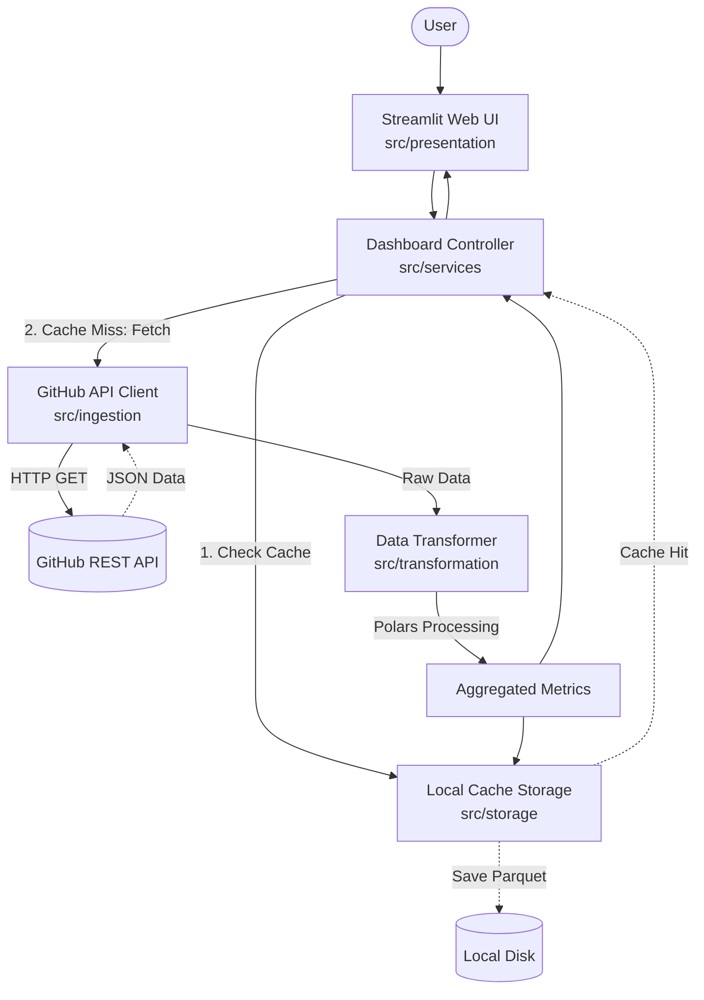

# System Architecture: GitHub Analytics Dashboard PoC

## Summary

This document describes the system architecture for the GitHub Analytics Dashboard Proof of Concept (PoC). The project aims to build a simple analysis system using Python, Polars, and Streamlit to fetch, process, and display data from the actual GitHub REST API. The solution is strictly bound to environment variables for secrets management and adheres to strict security, robust design, and performance principles like caching to prevent rate-limiting issues.

## System Design Objectives

The key objectives for this GitHub Analytics Dashboard PoC include delivering a functional, efficient, and user-friendly data extraction and visualization tool. These objectives are structured around robustness, security, and maintainability.

First and foremost, the system aims to seamlessly integrate with the live GitHub REST API. This entails creating a resilient client that can reliably fetch real-time repository data such as stargazers count, fork counts, and commit histories. Given the nature of external APIs, the integration must account for API rate limits and potential connectivity issues, requiring robust error handling (specifically targeting 403 Forbidden and 429 Too Many Requests status codes).

Security and compliance are paramount. The application must guarantee that sensitive information, primarily the GitHub Personal Access Token, is isolated from the source code. A strict separation must be enforced, relying entirely on environment variables loaded via `.env` files (managed by libraries such as `python-dotenv`). The application logs and UI must be sanitized so that stack traces and authentication credentials never leak to end users or logging services.

Performance and resource management dictate the implementation of a smart local caching layer. To mitigate excessive API requests and remain within GitHub's rate limits, data retrieved will be parsed and immediately cached locally in an efficient binary format like Parquet. This caching mechanism is expected to operate with a predefined Time-To-Live (TTL), reducing overhead and providing a near-instantaneous user experience on subsequent queries for the same repository.

Finally, the design emphasizes modularity and strict separation of concerns. The application will be decoupled into distinct layers: an Ingestion layer responsible for the API communication, a Transformation and Storage layer utilizing Polars for high-performance data wrangling and caching, and a Presentation layer using Streamlit for an interactive user interface. This pattern avoids creating "God Classes" and tightly coupled logic, making the code easier to test, extend, and maintain. Testing will be rigorous across all layers, utilizing `pytest` to guarantee the accuracy of data transformations and the reliability of the UI and API clients under both normal and exceptional conditions.

## System Architecture

The system operates using a multi-tiered architecture with strict separation of concerns to avoid tightly coupled logic. Each layer communicates through well-defined Pydantic schemas acting as data transfer objects (DTOs).

1. **Presentation Layer (Streamlit UI)**: Handles user inputs and renders metrics and charts. It never talks directly to the API or the local disk; it purely communicates with the Controller/Service layer.
2. **Service Layer (Controller)**: Orchestrates the workflow. It checks the cache first, delegates to the Ingestion Layer if data is missing, and passes results to the Transformation Layer before caching and returning data to the UI.
3. **Ingestion Layer (API Client)**: Encapsulates all GitHub REST API logic. It reads the `GITHUB_TOKEN` from environment variables, manages request headers, and handles HTTP errors safely.
4. **Transformation & Storage Layer (Polars & Cache)**: Uses Polars for fast data aggregation (e.g., date-based and committer-based metrics) and manages writing to/reading from local Parquet/CSV files.



**Boundary Management Rules:**
- The Ingestion Layer must return raw, unmutated responses validated through Pydantic schemas.
- The Transformation Layer must remain purely functional (no side-effects, no network calls).
- The Presentation Layer must not contain business logic; it is solely responsible for rendering data provided by the Service Layer.

## Design Architecture

The application adopts a Pydantic-first schema design to ensure type safety and data validation at the boundaries. Pydantic models represent the core domain objects, extending natively to support the workflow without polluting the logic layers.

```text
.
├── dev_documents/                  # Generated specs and tests
├── src/
│   ├── __init__.py
│   ├── config/                     # Settings and environment variables
│   │   ├── __init__.py
│   │   └── settings.py             # Pydantic BaseSettings
│   ├── domain_models/              # Core domain entities
│   │   ├── __init__.py
│   │   ├── repository.py           # Repository schema
│   │   └── commit.py               # Commit and Committer schemas
│   ├── ingestion/                  # External API communication
│   │   ├── __init__.py
│   │   └── github_client.py        # HTTP client
│   ├── transformation/             # Data processing (Polars)
│   │   ├── __init__.py
│   │   └── polars_processor.py     # Aggregation logic
│   ├── storage/                    # Local caching (Parquet)
│   │   ├── __init__.py
│   │   └── cache_manager.py        # Disk read/write logic
│   └── presentation/               # Streamlit application
│       ├── __init__.py
│       └── app.py                  # Main UI
└── tests/                          # Pytest suite
```

**Core Domain Pydantic Models:**
- `RepositoryInfo` (`src/domain_models/repository.py`): Captures repository metrics such as `stargazers_count`, `forks_count`, and `open_issues_count`. Utilizes `ConfigDict(extra="ignore")` to gracefully drop unused API payload fields.
- `CommitData` (`src/domain_models/commit.py`): Represents individual commit records. Contains nested structures for author details and date. Uses `@model_validator(mode="before")` to flatten the complex GitHub API JSON into a clean, flat Pydantic structure for easy Polars ingestion.
- `AppConfig` (`src/config/settings.py`): Inherits from `pydantic_settings.BaseSettings` to enforce the presence of `GITHUB_TOKEN` while maintaining it securely in the environment, using the `extra="forbid"` directive to ensure strict configuration.

## Implementation Plan

The development is decomposed into exactly 6 distinct cycles, ensuring incremental delivery and robust testing at each stage.

1. **CYCLE01: System Setup, Domain Models & Configuration**
   - Goal: Bootstrap the environment, define the core Pydantic domain models, and implement the `pydantic-settings` configuration loader.
   - Features: Setup `.env.example`, `settings.py`, and `domain_models`. Ensure `GITHUB_TOKEN` is safely read.
2. **CYCLE02: API Client & Raw Data Fetching**
   - Goal: Implement the `GitHubClient` to connect to the actual REST API.
   - Features: Robust HTTP requests using `httpx`, header injection, error handling for 403/429 limits, returning Pydantic objects.
3. **CYCLE03: Data Transformation (Polars)**
   - Goal: Build the data processing engine.
   - Features: Convert raw Python lists into Polars DataFrames. Group by date for daily commits, and aggregate by committer for top 5 committers.
4. **CYCLE04: Caching Mechanism (Parquet)**
   - Goal: Implement local storage to prevent API rate limiting.
   - Features: Save Polars DataFrames to `.parquet` format. Implement a TTL logic using `pathlib.Path.stat().st_mtime` to invalidate old cache.
5. **CYCLE05: Streamlit Web UI & Presentation Layer**
   - Goal: Build the interactive dashboard.
   - Features: Input forms for owner/repo, KPI metric cards, and Streamlit charts (`st.line_chart` and `st.bar_chart`).
6. **CYCLE06: E2E Testing, Final Assembly & Refinement**
   - Goal: Integrate all components via a central controller and execute comprehensive E2E tests.
   - Features: Combine UI, cache, and API. Run scenario tests and refine error messages to prevent data leakage.

## Test Strategy

A rigorous testing strategy is applied across all cycles to guarantee reliability and prevent regressions, utilizing `pytest` and specific plugins like `pytest-httpx` for isolation.

- **CYCLE01**: Unit tests for Pydantic models. We will pass invalid structures to ensure `extra="forbid"` and missing fields are caught properly. Configuration tests will mock the environment variables to verify the `BaseSettings` behavior without needing `.env`.
- **CYCLE02**: Integration tests for the API client. We will strictly use `pytest-httpx` to mock external API responses (including simulated 403 and 429 status codes). This ensures CI/CD resilience and sandbox stability without relying on real credentials during automated test runs.
- **CYCLE03**: Unit tests for the Polars transformation logic. We will supply static, mocked Pydantic objects or dictionaries to the transformer and assert that aggregations (like finding the Top 5 committers and date grouping) produce the correct DataFrame shapes and values.
- **CYCLE04**: Integration tests for local storage using `pytest`'s `tmp_path` fixture. This guarantees that file I/O operations occur in a temporary directory, avoiding side effects on the actual file system. We will mock `time.time` to simulate TTL expiration.
- **CYCLE05**: Component tests for the presentation logic. We will decouple the Streamlit UI functions to take pre-computed DataFrames as inputs, allowing unit testing of the UI formatting logic without invoking Streamlit's server engine.
- **CYCLE06**: E2E Testing using live environment simulations. For tests requiring persistent state or database setups (though this PoC relies on the file system and external APIs), tests will utilize fixtures that execute teardown hooks to purge temporary cache directories, ensuring a clean slate. Mocking will be selectively disabled only for explicitly marked `@pytest.mark.live` tests intended for manual validation against the live API.
