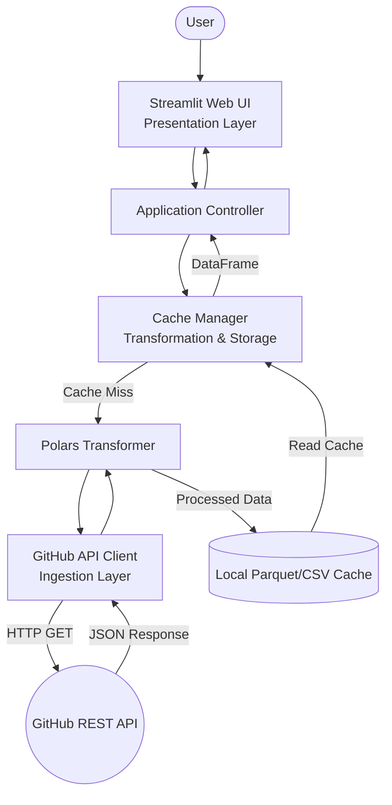

# System Architecture Document

## Summary
This document outlines the comprehensive system architecture for the GitHub Repository Analysis Dashboard Proof of Concept (PoC). The system is carefully designed and engineered using Python, integrating Polars for highly efficient data transformation and Streamlit for dynamic, user-friendly interactive web visualisations. Its primary purpose is to provide deep insights into any specified GitHub repository by fetching live data directly from the GitHub REST API, processing this data locally with exceptional performance, and displaying key performance indicators (KPIs) alongside historical trends through an accessible web interface. By adhering to modern software engineering principles, the system ensures robustness, scalability, and ease of maintenance throughout its lifecycle.

## System Design Objectives
The primary objective of this project is to construct a fully functional Proof of Concept (PoC) for a GitHub Repository Analysis Dashboard that demonstrates the seamless integration of live API ingestion, robust data processing, and interactive visualisation. This system must be built with a strong emphasis on security, particularly concerning the handling of authentication credentials, and must enforce strict separation of concerns across all its modules. The design must accommodate future scalability, allowing for the potential addition of new metrics, alternative data sources, or more complex analytical models without requiring a complete rewrite of the existing codebase.

A core constraint of the system is the absolute necessity to protect GitHub Personal Access Tokens. Under no circumstances should these tokens be hardcoded into the source code or inadvertently exposed in logs, error messages, or user interfaces. The system must strictly utilise environment variables, loaded via `dotenv` from a `.env` file, to manage these secrets securely. An `.env.example` file must be maintained as a safe template for developers. This security-first approach is non-negotiable and forms the foundation of our trust model.

Another significant constraint is the handling of GitHub API rate limits. The system must implement intelligent caching mechanisms to minimise redundant network requests and prevent the application from being temporarily blocked by the GitHub API due to excessive traffic. The local storage of processed data in Parquet or CSV formats serves as this caching layer, ensuring that repeated queries for the same repository within a specified Time-to-Live (TTL) window are served instantly from the local disk rather than triggering new API calls. This not only protects the application from rate-limiting penalties but also drastically improves the user experience by reducing load times for cached requests.

The success criteria for this PoC are defined by its ability to reliably perform end-to-end operations without failure under normal conditions, and to fail gracefully under abnormal conditions. Specifically, the system must successfully fetch data from the GitHub REST API, accurately parse the JSON responses, transform the raw data into structured Polars DataFrames, aggregate the necessary metrics (such as daily commit counts and top committers), and render these metrics flawlessly on a Streamlit dashboard. Furthermore, the system must demonstrate resilience by gracefully handling network errors, invalid user inputs, and unauthorised access attempts. When an error occurs, the system must display a user-friendly and informative error message on the UI without exposing sensitive internal state or stack traces.

In addition to functional requirements, the system must adhere to strict code quality and maintainability standards. The architecture must leverage modern design patterns, such as Dependency Injection and the Repository Pattern, to decouple data fetching logic from data processing and presentation logic. This modularity ensures that individual components can be tested in isolation, modified, or replaced with minimal impact on the rest of the system. The codebase must be fully type-hinted and pass all checks enforced by strict configuration of tools like `mypy` and `ruff`. This commitment to code quality ensures that the system remains understandable and maintainable as it evolves beyond the initial PoC phase into a more mature product. The additive mindset is key here: any new features must be implemented by extending existing interfaces rather than modifying core logic, thus preserving the stability of the foundation.
## System Design Objectives
The primary objective of this project is to construct a fully functional Proof of Concept (PoC) for a GitHub Repository Analysis Dashboard that demonstrates the seamless integration of live API ingestion, robust data processing, and interactive visualisation. This system must be built with a strong emphasis on security, particularly concerning the handling of authentication credentials, and must enforce strict separation of concerns across all its modules. The design must accommodate future scalability, allowing for the potential addition of new metrics, alternative data sources, or more complex analytical models without requiring a complete rewrite of the existing codebase.

A core constraint of the system is the absolute necessity to protect GitHub Personal Access Tokens. Under no circumstances should these tokens be hardcoded into the source code or inadvertently exposed in logs, error messages, or user interfaces. The system must strictly utilise environment variables, loaded via `dotenv` from a `.env` file, to manage these secrets securely. An `.env.example` file must be maintained as a safe template for developers. This security-first approach is non-negotiable and forms the foundation of our trust model.

Another significant constraint is the handling of GitHub API rate limits. The system must implement intelligent caching mechanisms to minimise redundant network requests and prevent the application from being temporarily blocked by the GitHub API due to excessive traffic. The local storage of processed data in Parquet or CSV formats serves as this caching layer, ensuring that repeated queries for the same repository within a specified Time-to-Live (TTL) window are served instantly from the local disk rather than triggering new API calls. This not only protects the application from rate-limiting penalties but also drastically improves the user experience by reducing load times for cached requests.

The success criteria for this PoC are defined by its ability to reliably perform end-to-end operations without failure under normal conditions, and to fail gracefully under abnormal conditions. Specifically, the system must successfully fetch data from the GitHub REST API, accurately parse the JSON responses, transform the raw data into structured Polars DataFrames, aggregate the necessary metrics (such as daily commit counts and top committers), and render these metrics flawlessly on a Streamlit dashboard. Furthermore, the system must demonstrate resilience by gracefully handling network errors, invalid user inputs, and unauthorised access attempts. When an error occurs, the system must display a user-friendly and informative error message on the UI without exposing sensitive internal state or stack traces.

In addition to functional requirements, the system must adhere to strict code quality and maintainability standards. The architecture must leverage modern design patterns, such as Dependency Injection and the Repository Pattern, to decouple data fetching logic from data processing and presentation logic. This modularity ensures that individual components can be tested in isolation, modified, or replaced with minimal impact on the rest of the system. The codebase must be fully type-hinted and pass all checks enforced by strict configuration of tools like `mypy` and `ruff`. This commitment to code quality ensures that the system remains understandable and maintainable as it evolves beyond the initial PoC phase into a more mature product. The additive mindset is key here: any new features must be implemented by extending existing interfaces rather than modifying core logic, thus preserving the stability of the foundation.

## System Architecture
The system architecture of the GitHub Repository Analysis Dashboard is built upon a modular, tiered design that strictly enforces the separation of concerns. This approach prevents the formation of tightly coupled "God Classes" and ensures that each component has a single, well-defined responsibility. The architecture is logically divided into three primary layers: the Ingestion Layer (API Client), the Transformation and Storage Layer (Data Processing and Caching), and the Presentation Layer (Web UI). This tiered structure allows for independent scaling, testing, and evolution of each part of the system.

At the base of the architecture is the Ingestion Layer, responsible for all interactions with external systems, specifically the GitHub REST API. This layer encapsulates the HTTP client logic, authentication header management, and raw JSON response parsing. By isolating these responsibilities, the rest of the system remains entirely agnostic to the specifics of the GitHub API, such as its URL structure, pagination mechanisms, or rate-limit headers. The Ingestion Layer must carefully handle network anomalies, timeouts, and API-specific errors (like 403 Forbidden or 429 Too Many Requests), translating them into domain-specific exceptions that can be understood and handled by upper layers. This explicit boundary management ensures that external failures do not cascade uncontrollably through the application.

Moving up the stack, the Transformation and Storage Layer acts as the core engine for data manipulation and performance optimisation. This layer receives raw, unstructured JSON data from the Ingestion Layer and utilises the Polars library to convert it into highly structured, typed DataFrames. Polars was selected for this role due to its exceptional performance characteristics, particularly its multi-threaded execution and efficient memory layout, which are crucial for processing potentially large commit histories quickly. This layer is also responsible for executing the business logic required to aggregate the data, such as grouping commits by date or by committer. Furthermore, this layer implements the local caching strategy, serialising the processed DataFrames into Parquet files on disk. By placing the caching mechanism here, the system guarantees that the Presentation Layer is shielded from the latency of both network requests and heavy data processing whenever cached data is available.

The uppermost tier is the Presentation Layer, implemented using Streamlit. This layer is strictly responsible for rendering the user interface, capturing user inputs (like the repository name), and displaying the aggregated metrics and charts. It contains absolutely no business logic or data fetching mechanisms. Instead, it interacts with the Transformation and Storage Layer through well-defined, typed interfaces. This strict separation ensures that the UI remains lightweight and responsive. If the requirement arises to replace Streamlit with another frontend framework (e.g., FastAPI with a React frontend) in the future, the Ingestion and Transformation layers can be reused without any modification. This additive and flexible mindset is a cornerstone of our architectural strategy.


The system strictly adheres to boundary management rules. The UI layer must never directly import or invoke the API client. All data flows must proceed sequentially through the defined layers. Pydantic models are used as data transfer objects (DTOs) between these layers, ensuring that data is strictly typed and validated at every boundary. This explicit contract between layers facilitates easier mocking during testing and significantly reduces the likelihood of runtime errors caused by unexpected data formats.
## System Architecture
The system architecture of the GitHub Repository Analysis Dashboard is built upon a modular, tiered design that strictly enforces the separation of concerns. This approach prevents the formation of tightly coupled "God Classes" and ensures that each component has a single, well-defined responsibility. The architecture is logically divided into three primary layers: the Ingestion Layer (API Client), the Transformation and Storage Layer (Data Processing and Caching), and the Presentation Layer (Web UI). This tiered structure allows for independent scaling, testing, and evolution of each part of the system.

At the base of the architecture is the Ingestion Layer, responsible for all interactions with external systems, specifically the GitHub REST API. This layer encapsulates the HTTP client logic, authentication header management, and raw JSON response parsing. By isolating these responsibilities, the rest of the system remains entirely agnostic to the specifics of the GitHub API, such as its URL structure, pagination mechanisms, or rate-limit headers. The Ingestion Layer must carefully handle network anomalies, timeouts, and API-specific errors (like 403 Forbidden or 429 Too Many Requests), translating them into domain-specific exceptions that can be understood and handled by upper layers. This explicit boundary management ensures that external failures do not cascade uncontrollably through the application.

Moving up the stack, the Transformation and Storage Layer acts as the core engine for data manipulation and performance optimisation. This layer receives raw, unstructured JSON data from the Ingestion Layer and utilises the Polars library to convert it into highly structured, typed DataFrames. Polars was selected for this role due to its exceptional performance characteristics, particularly its multi-threaded execution and efficient memory layout, which are crucial for processing potentially large commit histories quickly. This layer is also responsible for executing the business logic required to aggregate the data, such as grouping commits by date or by committer. Furthermore, this layer implements the local caching strategy, serialising the processed DataFrames into Parquet files on disk. By placing the caching mechanism here, the system guarantees that the Presentation Layer is shielded from the latency of both network requests and heavy data processing whenever cached data is available.

The uppermost tier is the Presentation Layer, implemented using Streamlit. This layer is strictly responsible for rendering the user interface, capturing user inputs (like the repository name), and displaying the aggregated metrics and charts. It contains absolutely no business logic or data fetching mechanisms. Instead, it interacts with the Transformation and Storage Layer through well-defined, typed interfaces. This strict separation ensures that the UI remains lightweight and responsive. If the requirement arises to replace Streamlit with another frontend framework (e.g., FastAPI with a React frontend) in the future, the Ingestion and Transformation layers can be reused without any modification. This additive and flexible mindset is a cornerstone of our architectural strategy.



The system strictly adheres to boundary management rules. The UI layer must never directly import or invoke the API client. All data flows must proceed sequentially through the defined layers. Pydantic models are used as data transfer objects (DTOs) between these layers, ensuring that data is strictly typed and validated at every boundary. This explicit contract between layers facilitates easier mocking during testing and significantly reduces the likelihood of runtime errors caused by unexpected data formats.

## Design Architecture
The design architecture of the system dictates the structural organisation of the codebase and the fundamental data models that flow through it. The file structure is meticulously planned to reflect the modular, tiered architecture described previously, ensuring that developers can intuitively locate the components they need to modify or extend. The project is organised into distinct directories representing the core domain logic, external integrations, data processing, and user interface.

```text
.
├── .env.example
├── pyproject.toml
├── README.md
├── src/
│   ├── __init__.py
│   ├── config.py
│   ├── domain/
│   │   ├── __init__.py
│   │   ├── models.py
│   │   └── exceptions.py
│   ├── ingestion/
│   │   ├── __init__.py
│   │   └── github_client.py
│   ├── processing/
│   │   ├── __init__.py
│   │   ├── transformer.py
│   │   └── cache_manager.py
│   └── presentation/
│       ├── __init__.py
│       └── app.py
└── tests/
    ├── __init__.py
    ├── conftest.py
    ├── unit/
    ├── integration/
    └── e2e/
```

At the heart of the design are the Core Domain Pydantic Models. These models serve as the single source of truth for the system's data structures, providing rigorous runtime type checking and validation. By defining these models centrally in `src/domain/models.py`, we ensure consistency across all layers of the application. The `RepositoryMetadata` model encapsulates essential information such as the repository name, owner, star count, fork count, and open issue count. The `CommitRecord` model represents individual commits, including the commit hash, author name, date, and commit message. These models are designed to be additive; if future requirements demand additional data points (e.g., pull request statistics), new optional fields can be safely added to these Pydantic schemas without breaking existing consumers.

The integration points between these domain objects and the rest of the system are clearly defined. The `github_client.py` in the Ingestion layer is responsible for parsing raw JSON dictionaries into these Pydantic models immediately upon receiving a response. This early validation ensures that invalid or incomplete data from the API is caught at the boundary, preventing corrupt data from propagating deeper into the system. The `transformer.py` in the Processing layer subsequently consumes lists of these Pydantic models, converting them into Polars DataFrames for efficient bulk operations. This transition from strongly-typed Python objects to high-performance DataFrames represents a deliberate design choice to balance type safety with computational efficiency.

Furthermore, the design incorporates specific mechanisms for extensibility. The use of Pydantic allows for the creation of base models that can be inherited and extended by new schema objects as the domain complexity grows. For instance, a generic `MetricResult` model could be extended into `CommitTrendMetric` or `TopCommitterMetric` to provide structured outputs for the UI layer. This adherence to modern software design patterns, specifically the rigorous use of typed contracts and validation at boundaries, prevents the emergence of tightly coupled, fragile code and guarantees that the system remains robust and adaptable to future enhancements.
## Design Architecture
The design architecture of the system dictates the structural organisation of the codebase and the fundamental data models that flow through it. The file structure is meticulously planned to reflect the modular, tiered architecture described previously, ensuring that developers can intuitively locate the components they need to modify or extend. The project is organised into distinct directories representing the core domain logic, external integrations, data processing, and user interface.

```text
.
├── .env.example
├── pyproject.toml
├── README.md
├── src/
│   ├── __init__.py
│   ├── config.py
│   ├── domain/
│   │   ├── __init__.py
│   │   ├── models.py
│   │   └── exceptions.py
│   ├── ingestion/
│   │   ├── __init__.py
│   │   └── github_client.py
│   ├── processing/
│   │   ├── __init__.py
│   │   ├── transformer.py
│   │   └── cache_manager.py
│   └── presentation/
│       ├── __init__.py
│       └── app.py
└── tests/
    ├── __init__.py
    ├── conftest.py
    ├── unit/
    ├── integration/
    └── e2e/
```

At the heart of the design are the Core Domain Pydantic Models. These models serve as the single source of truth for the system's data structures, providing rigorous runtime type checking and validation. By defining these models centrally in `src/domain/models.py`, we ensure consistency across all layers of the application. The `RepositoryMetadata` model encapsulates essential information such as the repository name, owner, star count, fork count, and open issue count. The `CommitRecord` model represents individual commits, including the commit hash, author name, date, and commit message. These models are designed to be additive; if future requirements demand additional data points (e.g., pull request statistics), new optional fields can be safely added to these Pydantic schemas without breaking existing consumers.

The integration points between these domain objects and the rest of the system are clearly defined. The `github_client.py` in the Ingestion layer is responsible for parsing raw JSON dictionaries into these Pydantic models immediately upon receiving a response. This early validation ensures that invalid or incomplete data from the API is caught at the boundary, preventing corrupt data from propagating deeper into the system. The `transformer.py` in the Processing layer subsequently consumes lists of these Pydantic models, converting them into Polars DataFrames for efficient bulk operations. This transition from strongly-typed Python objects to high-performance DataFrames represents a deliberate design choice to balance type safety with computational efficiency.

Furthermore, the design incorporates specific mechanisms for extensibility. The use of Pydantic allows for the creation of base models that can be inherited and extended by new schema objects as the domain complexity grows. For instance, a generic `MetricResult` model could be extended into `CommitTrendMetric` or `TopCommitterMetric` to provide structured outputs for the UI layer. This adherence to modern software design patterns, specifically the rigorous use of typed contracts and validation at boundaries, prevents the emergence of tightly coupled, fragile code and guarantees that the system remains robust and adaptable to future enhancements.

## Implementation Plan

### CYCLE01: API Client and Data Extraction (Ingestion)
The first cycle focuses entirely on establishing a robust, secure, and reliable connection to the external GitHub REST API. The primary objective is to implement the Ingestion Layer, ensuring that the system can authenticate correctly, handle rate limits gracefully, and retrieve the required raw data. We will begin by setting up the necessary configuration management using `python-dotenv` to securely load the GitHub Personal Access Token from the `.env` file, strictly enforcing the rule that no credentials are ever hardcoded. This includes creating the `.env.example` template.

Following configuration, the core `github_client.py` will be developed. This module will encapsulate the `httpx` or `requests` library to perform GET requests against the `/repos/{owner}/{repo}` endpoint for repository metadata and the `/repos/{owner}/{repo}/commits` endpoint for the commit history. Crucially, this client must implement sophisticated error handling. It must distinguish between a 404 Not Found (invalid repository), a 401/403 Unauthorized (invalid token), and a 429 Too Many Requests (rate limit exceeded), raising specific, custom domain exceptions for each scenario. The raw JSON responses will be immediately parsed and validated against our core Pydantic models to ensure data integrity at the system boundary. By the end of this cycle, the system will have a fully functional Python script capable of extracting data from the live API securely.

### CYCLE02: Data Transformation and Local Caching (Transformation & Storage)
The second cycle builds upon the foundation of Cycle 1 by introducing the Transformation and Storage Layer. The raw, validated Pydantic models acquired from the Ingestion Layer must now be processed into meaningful analytical formats. We will integrate the `polars` library to perform high-speed data manipulation. The `transformer.py` module will be implemented to execute two specific aggregations: calculating the number of commits per day (YYYY-MM-DD) and determining the top 5 committers by commit volume. Polars' expressive API will be used to ensure these transformations are both readable and highly performant.

Simultaneously, we will implement the critical caching mechanism in `cache_manager.py` to protect against API rate limits and improve application responsiveness. This manager will be responsible for serialising the aggregated Polars DataFrames into Parquet format and saving them to a local temporary directory. A Time-to-Live (TTL) logic, initially set to 1 hour, will be implemented. Before the system attempts to fetch new data from the API via the Ingestion Layer, the Cache Manager must first check if a valid, unexpired Parquet file exists for the requested repository. If it does, the data will be read directly from the disk cache, bypassing the API entirely. This cycle requires careful implementation of file I/O operations and robust handling of potential cache corruption or permission issues.

### CYCLE03: Web UI Construction (Visualization)
The third and final cycle focuses on delivering the user-facing component of the PoC by constructing the Presentation Layer using Streamlit. The `app.py` module will be created to serve as the main entry point for the application. The UI will be designed for simplicity and ease of use, featuring a prominent text input field where users can specify the target repository in the `owner/repo` format. Input validation will be implemented at this level to catch obvious formatting errors before any backend processing is triggered.

Once a valid repository is submitted, the UI will orchestrate the data flow by calling the Application Controller, which in turn interacts with the Cache Manager and API Client as implemented in previous cycles. The retrieved and processed data will then be visualised. The repository metadata (stars, forks, open issues) will be prominently displayed as KPI metrics at the top of the dashboard. Below the KPIs, Streamlit's native charting functions (`st.line_chart` and `st.bar_chart`) will be utilised to render the commit history trends over time and the leaderboard of top committers. A critical aspect of this cycle is implementing graceful error handling in the UI; any exceptions raised by the lower layers (e.g., API failures or parsing errors) must be caught and displayed as user-friendly warning or error messages (`st.error`), strictly avoiding the exposure of raw stack traces to the end-user.
## Implementation Plan

### CYCLE01: API Client and Data Extraction (Ingestion)
The first cycle focuses entirely on establishing a robust, secure, and reliable connection to the external GitHub REST API. The primary objective is to implement the Ingestion Layer, ensuring that the system can authenticate correctly, handle rate limits gracefully, and retrieve the required raw data. We will begin by setting up the necessary configuration management using `python-dotenv` to securely load the GitHub Personal Access Token from the `.env` file, strictly enforcing the rule that no credentials are ever hardcoded. This includes creating the `.env.example` template.

Following configuration, the core `github_client.py` will be developed. This module will encapsulate the `httpx` or `requests` library to perform GET requests against the `/repos/{owner}/{repo}` endpoint for repository metadata and the `/repos/{owner}/{repo}/commits` endpoint for the commit history. Crucially, this client must implement sophisticated error handling. It must distinguish between a 404 Not Found (invalid repository), a 401/403 Unauthorized (invalid token), and a 429 Too Many Requests (rate limit exceeded), raising specific, custom domain exceptions for each scenario. The raw JSON responses will be immediately parsed and validated against our core Pydantic models to ensure data integrity at the system boundary. By the end of this cycle, the system will have a fully functional Python script capable of extracting data from the live API securely.

### CYCLE02: Data Transformation and Local Caching (Transformation & Storage)
The second cycle builds upon the foundation of Cycle 1 by introducing the Transformation and Storage Layer. The raw, validated Pydantic models acquired from the Ingestion Layer must now be processed into meaningful analytical formats. We will integrate the `polars` library to perform high-speed data manipulation. The `transformer.py` module will be implemented to execute two specific aggregations: calculating the number of commits per day (YYYY-MM-DD) and determining the top 5 committers by commit volume. Polars' expressive API will be used to ensure these transformations are both readable and highly performant.

Simultaneously, we will implement the critical caching mechanism in `cache_manager.py` to protect against API rate limits and improve application responsiveness. This manager will be responsible for serialising the aggregated Polars DataFrames into Parquet format and saving them to a local temporary directory. A Time-to-Live (TTL) logic, initially set to 1 hour, will be implemented. Before the system attempts to fetch new data from the API via the Ingestion Layer, the Cache Manager must first check if a valid, unexpired Parquet file exists for the requested repository. If it does, the data will be read directly from the disk cache, bypassing the API entirely. This cycle requires careful implementation of file I/O operations and robust handling of potential cache corruption or permission issues.

### CYCLE03: Web UI Construction (Visualization)
The third and final cycle focuses on delivering the user-facing component of the PoC by constructing the Presentation Layer using Streamlit. The `app.py` module will be created to serve as the main entry point for the application. The UI will be designed for simplicity and ease of use, featuring a prominent text input field where users can specify the target repository in the `owner/repo` format. Input validation will be implemented at this level to catch obvious formatting errors before any backend processing is triggered.

Once a valid repository is submitted, the UI will orchestrate the data flow by calling the Application Controller, which in turn interacts with the Cache Manager and API Client as implemented in previous cycles. The retrieved and processed data will then be visualised. The repository metadata (stars, forks, open issues) will be prominently displayed as KPI metrics at the top of the dashboard. Below the KPIs, Streamlit's native charting functions (`st.line_chart` and `st.bar_chart`) will be utilised to render the commit history trends over time and the leaderboard of top committers. A critical aspect of this cycle is implementing graceful error handling in the UI; any exceptions raised by the lower layers (e.g., API failures or parsing errors) must be caught and displayed as user-friendly warning or error messages (`st.error`), strictly avoiding the exposure of raw stack traces to the end-user.

## Test Strategy

### CYCLE01
The testing strategy for Cycle 1 mandates a rigorous approach to validating the Ingestion Layer. Unit tests must be written to verify the configuration loading mechanism, ensuring that the system correctly reads the token from the `.env` file and fails appropriately if the token is missing or malformed. The core of the testing effort will focus on the `github_client.py`. We will utilise the `unittest.mock` or `pytest-mock` frameworks extensively to simulate various API responses without making actual network calls. This involves mocking the HTTP client to return successful JSON payloads, simulating 404 errors for non-existent repositories, and simulating 403/429 errors to verify that the client raises the correct custom exceptions.

Crucially, the DB Rollback Rule and sandbox resilience must be respected. Any tests that require setting up temporary state or files must use Pytest fixtures that clean up after themselves, ensuring lightning-fast state resets. Furthermore, because the sandbox environment executing these tests autonomously will not possess real GitHub API keys, it is absolutely critical that all external API calls are mocked in unit and integration tests. Attempting real network calls without valid credentials will cause pipeline failures. However, to fulfill the requirement of Live API E2E testing, a separate, explicitly marked test suite (e.g., using `@pytest.mark.live`) will be created. This live suite will only run when a valid token is provided and will perform actual HTTP requests against a known, stable repository (like `streamlit/streamlit`) to verify the end-to-end connectivity and parsing logic against real-world data.

### CYCLE02
Testing in Cycle 2 focuses on verifying the accuracy of the data transformations and the reliability of the caching mechanism. Unit tests for the `transformer.py` module will be critical. We must provide static, well-defined mock datasets (e.g., a list of mock Pydantic `CommitRecord` objects) as input to the transformation functions and assert that the resulting Polars DataFrames contain exactly the expected aggregated values for daily commit counts and the top 5 committers. These tests must account for edge cases, such as empty datasets, datasets with commits spanning multiple years, and datasets where multiple committers have the exact same number of commits (testing tie-breaking behavior).

The `cache_manager.py` must be tested using a strategy that isolates file system operations. Pytest's built-in `tmp_path` fixture is mandatory for these tests. The tests will verify that the manager can successfully write a DataFrame to a Parquet file within the temporary directory, that it can subsequently read that file back into an identical DataFrame, and that it correctly identifies when a cached file has expired based on the TTL logic. We must also simulate file system errors, such as permission denied or disk full scenarios, using mocking to ensure the system handles these graceful without crashing. The DB Rollback Rule applies here metaphorically: every test interacting with the file system must start with a clean temporary directory and leave no residual files behind, ensuring absolute test isolation.

### CYCLE03
The test strategy for Cycle 3 involves verifying the Presentation Layer and the overall integration of the application. Since testing Streamlit UIs directly can be complex, our primary focus will be on the application controller logic that feeds data to the UI. We will write integration tests that simulate a user request by calling the main entry point function with a mock repository name. These tests will mock the external API call (if not relying on cached data) but will allow the data to flow through the Transformation and Storage layers, finally asserting that the data structures returned to the UI layer match expectations.

Furthermore, we will employ a rigorous manual or automated User Acceptance Testing (UAT) process. The provided `USER_TEST_SCENARIO.md` will serve as the script for this validation. We will verify that the UI renders the correct KPIs and charts when provided with valid input, and that it displays appropriate, human-readable error messages when provided with invalid input or when simulated API errors occur. The strict requirement that no secrets are exposed in the UI or logs will be verified dynamically by running the application with invalid tokens and inspecting the output. End-to-End (E2E) verification will be confirmed by ensuring that the `streamlit run` command successfully launches the application and processes a complete data flow from the live GitHub API to the interactive dashboard.
## Test Strategy

### CYCLE01
The testing strategy for Cycle 1 mandates a rigorous approach to validating the Ingestion Layer. Unit tests must be written to verify the configuration loading mechanism, ensuring that the system correctly reads the token from the `.env` file and fails appropriately if the token is missing or malformed. The core of the testing effort will focus on the `github_client.py`. We will utilise the `unittest.mock` or `pytest-mock` frameworks extensively to simulate various API responses without making actual network calls. This involves mocking the HTTP client to return successful JSON payloads, simulating 404 errors for non-existent repositories, and simulating 403/429 errors to verify that the client raises the correct custom exceptions.

Crucially, the DB Rollback Rule and sandbox resilience must be respected. Any tests that require setting up temporary state or files must use Pytest fixtures that clean up after themselves, ensuring lightning-fast state resets. Furthermore, because the sandbox environment executing these tests autonomously will not possess real GitHub API keys, it is absolutely critical that all external API calls are mocked in unit and integration tests. Attempting real network calls without valid credentials will cause pipeline failures. However, to fulfill the requirement of Live API E2E testing, a separate, explicitly marked test suite (e.g., using `@pytest.mark.live`) will be created. This live suite will only run when a valid token is provided and will perform actual HTTP requests against a known, stable repository (like `streamlit/streamlit`) to verify the end-to-end connectivity and parsing logic against real-world data.

### CYCLE02
Testing in Cycle 2 focuses on verifying the accuracy of the data transformations and the reliability of the caching mechanism. Unit tests for the `transformer.py` module will be critical. We must provide static, well-defined mock datasets (e.g., a list of mock Pydantic `CommitRecord` objects) as input to the transformation functions and assert that the resulting Polars DataFrames contain exactly the expected aggregated values for daily commit counts and the top 5 committers. These tests must account for edge cases, such as empty datasets, datasets with commits spanning multiple years, and datasets where multiple committers have the exact same number of commits (testing tie-breaking behavior).

The `cache_manager.py` must be tested using a strategy that isolates file system operations. Pytest's built-in `tmp_path` fixture is mandatory for these tests. The tests will verify that the manager can successfully write a DataFrame to a Parquet file within the temporary directory, that it can subsequently read that file back into an identical DataFrame, and that it correctly identifies when a cached file has expired based on the TTL logic. We must also simulate file system errors, such as permission denied or disk full scenarios, using mocking to ensure the system handles these graceful without crashing. The DB Rollback Rule applies here metaphorically: every test interacting with the file system must start with a clean temporary directory and leave no residual files behind, ensuring absolute test isolation.

### CYCLE03
The test strategy for Cycle 3 involves verifying the Presentation Layer and the overall integration of the application. Since testing Streamlit UIs directly can be complex, our primary focus will be on the application controller logic that feeds data to the UI. We will write integration tests that simulate a user request by calling the main entry point function with a mock repository name. These tests will mock the external API call (if not relying on cached data) but will allow the data to flow through the Transformation and Storage layers, finally asserting that the data structures returned to the UI layer match expectations.

Furthermore, we will employ a rigorous manual or automated User Acceptance Testing (UAT) process. The provided `USER_TEST_SCENARIO.md` will serve as the script for this validation. We will verify that the UI renders the correct KPIs and charts when provided with valid input, and that it displays appropriate, human-readable error messages when provided with invalid input or when simulated API errors occur. The strict requirement that no secrets are exposed in the UI or logs will be verified dynamically by running the application with invalid tokens and inspecting the output. End-to-End (E2E) verification will be confirmed by ensuring that the `streamlit run` command successfully launches the application and processes a complete data flow from the live GitHub API to the interactive dashboard.
